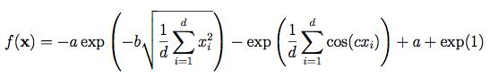

```{r setup, include=FALSE}
library(knitr)
opts_chunk$set(fig.align = "center", 
               out.width = "80%",
               fig.width = 6, fig.height = 5,
               dev = "svg", fig.ext = "svg",
               par = TRUE, # needed for setting hook 
               collapse = TRUE, # collapse input & output code in chunks
               warning = FALSE)

knit_hooks$set(par = function(before, options, envir)
  { if(before && options$fig.show != "none") 
       par(family = "sans", mar=c(4.1,4.1,1.1,1.1), mgp=c(3,1,0), tcl=-0.5)
})
```

```{r, message = FALSE}
library(cmaesr)
```

## Introduction

The _cmaesr_ package implements the popular Covariance Matrix Adaptation - Evolution Strategy optimizer for non-linear, non-convex numerical optimization problems in pure R.

Please refer to:

- https://cran.r-project.org/web/packages/cmaesr/index.html
- https://github.com/jakobbossek/cmaesr

for a complete introduction to the software. Please address questions and missing features about the _cmaesr_ package to the author Jakob Bossek at j.bossek@gmail.com. 
```{r}

```

## Example 1

Assume we want to minimize the 2D Ackley Function. To accomplish this task we first need to define the objective function as a _smoof_ function (unless it is already a built-in function, which is the case). This function is then passed with some control arguments to the main function of the package, _cmaes_ (see below).

The _Ackley_ function is widely used for testing optimization algorithms. In its two-dimensional form ($d=2$), as shown in the plots, it is characterized by a nearly flat outer region, and a large hole at the centre. The function poses a high risk for optimization algorithms, particularly hillclimbing algorithms, to be trapped in one of its many local minima.

Recommended variable values are: $a = 20, b = 0.2$ and $c = 2\pi$. 

```{r}
library(ggplot2)
library(plot3D)

# first generate the objective smoof function (and plot it)
obj.fn = makeAckleyFunction(dimensions = 2L)
print(obj.fn)
print(autoplot(obj.fn))
plot3D(obj.fn, length.out = 50L, contour = TRUE)
```

Note that the function has a global optimum objective value of 0 at the origin (this information is available upon printing the R object). The function is usually evaluated on the hypercube $[-32.768, 32.768]$, although it may also be restricted to a smaller domain:

```{r echo=FALSE, out.width='80%'}

```

```{r}
res = cmaes(
    obj.fn, 
    monitor = makeSimpleMonitor(),
    control = list(
        sigma = 1.5, # initial step size
        lambda = 50, # number of offspring
        stop.ons = c(
            list(stopOnMaxIters(100)), # stop after 100 iterations
            getDefaultStoppingConditions() # or after default stopping conditions
        )
    )
)
print(res)
```


The results are (usually but not always) very good indeed.

## Setting up a user-defined objective function by hand

For illlustration purposes, let us consider the (toy) problem of finding the (global) minimum of the multimodal target function $f(x) = x sin(3x)$ on the closed interval $[0, 2\pi]$. We define our target function via the _makeSingleObjectiveFunction()_ method providing a name, the function itself and a parameter set. We can display the function within the box constraints with _ggplot_.

```{r}
obj.fn = makeSingleObjectiveFunction(
  name = "This is my first function name",
  fn = function(x) x * sin(3*x),
  par.set = makeNumericParamSet("x", len = 1L, lower = 0, upper = 2 * pi)
)

print(obj.fn)
print(getParamSet(obj.fn))
print(autoplot(obj.fn))
```
